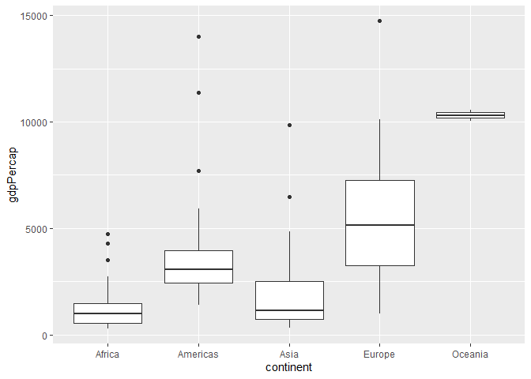
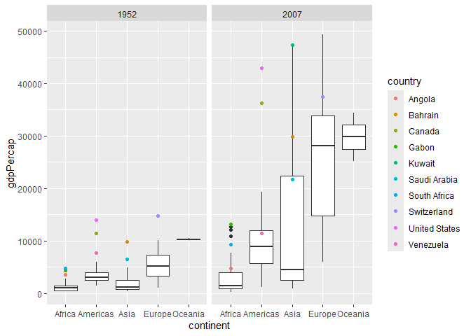
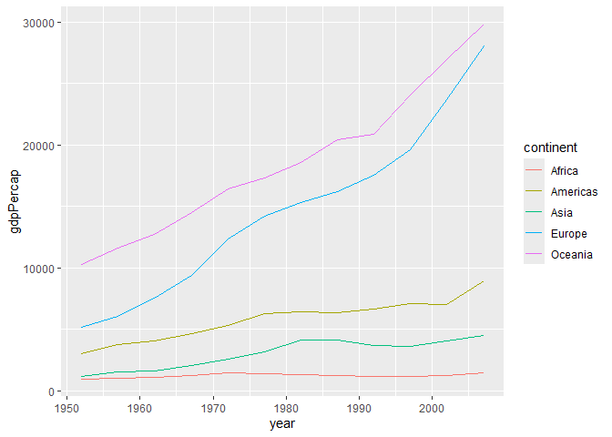
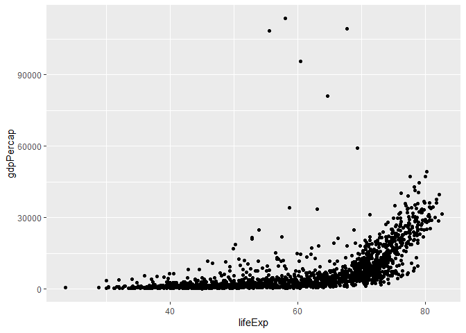
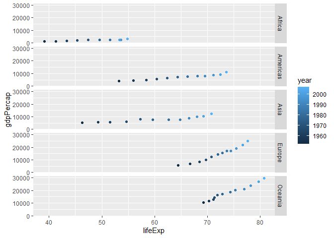

Gapminder
================
Nerissa Theisen
2026-09-24

- [Grading Rubric](#grading-rubric)
  - [Individual](#individual)
  - [Submission](#submission)
- [Guided EDA](#guided-eda)
  - [**q0** Perform your “first checks” on the dataset. What variables
    are in
    this](#q0-perform-your-first-checks-on-the-dataset-what-variables-are-in-this)
  - [**q1** Determine the most and least recent years in the `gapminder`
    dataset.](#q1-determine-the-most-and-least-recent-years-in-the-gapminder-dataset)
  - [**q2** Filter on years matching `year_min`, and make a plot of the
    GDP per capita against continent. Choose an appropriate `geom_` to
    visualize the data. What observations can you
    make?](#q2-filter-on-years-matching-year_min-and-make-a-plot-of-the-gdp-per-capita-against-continent-choose-an-appropriate-geom_-to-visualize-the-data-what-observations-can-you-make)
  - [**q3** You should have found *at least* three outliers in q2 (but
    possibly many more!). Identify those outliers (figure out which
    countries they
    are).](#q3-you-should-have-found-at-least-three-outliers-in-q2-but-possibly-many-more-identify-those-outliers-figure-out-which-countries-they-are)
  - [**q4** Create a plot similar to yours from q2 studying both
    `year_min` and `year_max`. Find a way to highlight the outliers from
    q3 on your plot *in a way that lets you identify which country is
    which*. Compare the patterns between `year_min` and
    `year_max`.](#q4-create-a-plot-similar-to-yours-from-q2-studying-both-year_min-and-year_max-find-a-way-to-highlight-the-outliers-from-q3-on-your-plot-in-a-way-that-lets-you-identify-which-country-is-which-compare-the-patterns-between-year_min-and-year_max)
- [Your Own EDA](#your-own-eda)
  - [**q5** Create *at least* three new figures below. With each figure,
    try to pose new questions about the
    data.](#q5-create-at-least-three-new-figures-below-with-each-figure-try-to-pose-new-questions-about-the-data)

*Purpose*: Learning to do EDA well takes practice! In this challenge
you’ll further practice EDA by first completing a guided exploration,
then by conducting your own investigation. This challenge will also give
you a chance to use the wide variety of visual tools we’ve been
learning.

<!-- include-rubric -->

# Grading Rubric

<!-- -------------------------------------------------- -->

Unlike exercises, **challenges will be graded**. The following rubrics
define how you will be graded, both on an individual and team basis.

## Individual

<!-- ------------------------- -->

| Category | Needs Improvement | Satisfactory |
|----|----|----|
| Effort | Some task **q**’s left unattempted | All task **q**’s attempted |
| Observed | Did not document observations, or observations incorrect | Documented correct observations based on analysis |
| Supported | Some observations not clearly supported by analysis | All observations clearly supported by analysis (table, graph, etc.) |
| Assessed | Observations include claims not supported by the data, or reflect a level of certainty not warranted by the data | Observations are appropriately qualified by the quality & relevance of the data and (in)conclusiveness of the support |
| Specified | Uses the phrase “more data are necessary” without clarification | Any statement that “more data are necessary” specifies which *specific* data are needed to answer what *specific* question |
| Code Styled | Violations of the [style guide](https://style.tidyverse.org/) hinder readability | Code sufficiently close to the [style guide](https://style.tidyverse.org/) |

## Submission

<!-- ------------------------- -->

Make sure to commit both the challenge report (`report.md` file) and
supporting files (`report_files/` folder) when you are done! Then submit
a link to Canvas. **Your Challenge submission is not complete without
all files uploaded to GitHub.**

``` r
library(tidyverse)
```

    ## ── Attaching core tidyverse packages ──────────────────────── tidyverse 2.0.0 ──
    ## ✔ dplyr     1.2.1     ✔ readr     2.2.0
    ## ✔ forcats   1.0.1     ✔ stringr   1.6.0
    ## ✔ ggplot2   4.0.3     ✔ tibble    3.3.1
    ## ✔ lubridate 1.9.5     ✔ tidyr     1.3.2
    ## ✔ purrr     1.2.2     
    ## ── Conflicts ────────────────────────────────────────── tidyverse_conflicts() ──
    ## ✖ dplyr::filter() masks stats::filter()
    ## ✖ dplyr::lag()    masks stats::lag()
    ## ℹ Use the conflicted package (<http://conflicted.r-lib.org/>) to force all conflicts to become errors

``` r
library(gapminder)
```

*Background*: [Gapminder](https://www.gapminder.org/about-gapminder/) is
an independent organization that seeks to educate people about the state
of the world. They seek to counteract the worldview constructed by a
hype-driven media cycle, and promote a “fact-based worldview” by
focusing on data. The dataset we’ll study in this challenge is from
Gapminder.

# Guided EDA

<!-- -------------------------------------------------- -->

First, we’ll go through a round of *guided EDA*. Try to pay attention to
the high-level process we’re going through—after this guided round
you’ll be responsible for doing another cycle of EDA on your own!

### **q0** Perform your “first checks” on the dataset. What variables are in this

dataset?

``` r
## TASK: Do your "first checks" here!
glimpse(gapminder)
```

    ## Rows: 1,704
    ## Columns: 6
    ## $ country   <fct> "Afghanistan", "Afghanistan", "Afghanistan", "Afghanistan", …
    ## $ continent <fct> Asia, Asia, Asia, Asia, Asia, Asia, Asia, Asia, Asia, Asia, …
    ## $ year      <int> 1952, 1957, 1962, 1967, 1972, 1977, 1982, 1987, 1992, 1997, …
    ## $ lifeExp   <dbl> 28.801, 30.332, 31.997, 34.020, 36.088, 38.438, 39.854, 40.8…
    ## $ pop       <int> 8425333, 9240934, 10267083, 11537966, 13079460, 14880372, 12…
    ## $ gdpPercap <dbl> 779.4453, 820.8530, 853.1007, 836.1971, 739.9811, 786.1134, …

``` r
summary(gapminder)
```

    ##         country        continent        year         lifeExp     
    ##  Afghanistan:  12   Africa  :624   Min.   :1952   Min.   :23.60  
    ##  Albania    :  12   Americas:300   1st Qu.:1966   1st Qu.:48.20  
    ##  Algeria    :  12   Asia    :396   Median :1980   Median :60.71  
    ##  Angola     :  12   Europe  :360   Mean   :1980   Mean   :59.47  
    ##  Argentina  :  12   Oceania : 24   3rd Qu.:1993   3rd Qu.:70.85  
    ##  Australia  :  12                  Max.   :2007   Max.   :82.60  
    ##  (Other)    :1632                                                
    ##       pop              gdpPercap       
    ##  Min.   :6.001e+04   Min.   :   241.2  
    ##  1st Qu.:2.794e+06   1st Qu.:  1202.1  
    ##  Median :7.024e+06   Median :  3531.8  
    ##  Mean   :2.960e+07   Mean   :  7215.3  
    ##  3rd Qu.:1.959e+07   3rd Qu.:  9325.5  
    ##  Max.   :1.319e+09   Max.   :113523.1  
    ## 

**Observations**:

- Variables: `country`, `continent`, `year`, `lifeExp`, `pop`, and
  `gdpPercap`

### **q1** Determine the most and least recent years in the `gapminder` dataset.

*Hint*: Use the `pull()` function to get a vector out of a tibble.
(Rather than the `$` notation of base R.)

``` r
## TASK: Find the largest and smallest values of `year` in `gapminder`
year_max <- gapminder %>%
  select(year) %>%
  max()
  
year_min <- gapminder %>%
  select(year) %>%
  min()
```

Use the following test to check your work.

``` r
## NOTE: No need to change this
assertthat::assert_that(year_max %% 7 == 5)
```

    ## [1] TRUE

``` r
assertthat::assert_that(year_max %% 3 == 0)
```

    ## [1] TRUE

``` r
assertthat::assert_that(year_min %% 7 == 6)
```

    ## [1] TRUE

``` r
assertthat::assert_that(year_min %% 3 == 2)
```

    ## [1] TRUE

``` r
if (is_tibble(year_max)) {
  print("year_max is a tibble; try using `pull()` to get a vector")
  assertthat::assert_that(False)
}

print("Nice!")
```

    ## [1] "Nice!"

### **q2** Filter on years matching `year_min`, and make a plot of the GDP per capita against continent. Choose an appropriate `geom_` to visualize the data. What observations can you make?

You may encounter difficulties in visualizing these data; if so document
your challenges and attempt to produce the most informative visual you
can.

``` r
## TASK: Create a visual of gdpPercap vs continent
gapminder %>%
  filter(year == year_min & gdpPercap < 15000) %>%
  ggplot(aes(x = continent, y = gdpPercap)) +
  geom_boxplot() 
```

<!-- -->

**Observations**:

- Oceania is the only continent with no outliers.
- Oceania has the highest median GDP per capita, while Asia and Africa
  have the lowest median GDP per capita.
- Africa’s outlier countries have the smallest difference in GDP per
  capita compared to the outlier countries of other continents.
- Europe has the greatest spread of GDP per capita, while Oceania has
  the least spread.
- The highest GDP per capita shown on the plot is in Europe.
- Africa, the Americas, and Asia all have a median GDP per capita
  under 5000. Oceania is t the only continent to have a median GDP per
  capita over 10000.
- There are no outliers beneath the medians, only above.

**Difficulties & Approaches**:

- The data are hard to read on a box plot because of one outlier country
  in Asia. Since it has a much greater GDP per capita than any other
  country, it widens the axis of the plot and zooms out on the boxes.
  For continents like Africa and Oceania, the median line blends in with
  the box outline, and it’s harder to tell where it is relative to other
  medians. I noticed that every other country has a GDP per capita below
  15000, so I filtered the data based on that. This widened the view of
  the boxes and made them easier to interpret.

### **q3** You should have found *at least* three outliers in q2 (but possibly many more!). Identify those outliers (figure out which countries they are).

``` r
## TASK: Identify the outliers from q2
gapminder %>%
  filter(year == year_min) %>%
  group_by(continent) %>%
  arrange(-gdpPercap, .by_group = TRUE)
```

    ## # A tibble: 142 × 6
    ## # Groups:   continent [5]
    ##    country      continent  year lifeExp      pop gdpPercap
    ##    <fct>        <fct>     <int>   <dbl>    <int>     <dbl>
    ##  1 South Africa Africa     1952    45.0 14264935     4725.
    ##  2 Gabon        Africa     1952    37.0   420702     4293.
    ##  3 Angola       Africa     1952    30.0  4232095     3521.
    ##  4 Reunion      Africa     1952    52.7   257700     2719.
    ##  5 Djibouti     Africa     1952    34.8    63149     2670.
    ##  6 Algeria      Africa     1952    43.1  9279525     2449.
    ##  7 Namibia      Africa     1952    41.7   485831     2424.
    ##  8 Libya        Africa     1952    42.7  1019729     2388.
    ##  9 Congo, Rep.  Africa     1952    42.1   854885     2126.
    ## 10 Mauritius    Africa     1952    51.0   516556     1968.
    ## # ℹ 132 more rows

**Observations**:

- Identify the outlier countries from q2:
  - South Africa, Gabon, Angola, United States, Canada, Venezuela,
    Kuwait, Bahrain, Saudi Arabia, and Switzerland

*Hint*: For the next task, it’s helpful to know a ggplot trick we’ll
learn in an upcoming exercise: You can use the `data` argument inside
any `geom_*` to modify the data that will be plotted *by that geom
only*. For instance, you can use this trick to filter a set of points to
label:

``` r
## NOTE: No need to edit, use ideas from this in q4 below
gapminder %>%
  filter(year == max(year)) %>%

  ggplot(aes(continent, lifeExp)) +
  geom_boxplot() +
  geom_point(
    data = . %>% filter(country %in% c("United Kingdom", "Japan", "Zambia")),
    mapping = aes(color = country),
    size = 2
  )
```

<!-- -->

### **q4** Create a plot similar to yours from q2 studying both `year_min` and `year_max`. Find a way to highlight the outliers from q3 on your plot *in a way that lets you identify which country is which*. Compare the patterns between `year_min` and `year_max`.

*Hint*: We’ve learned a lot of different ways to show multiple
variables; think about using different aesthetics or facets.

``` r
## TASK: Create a visual of gdpPercap vs continent
gapminder %>% 
  filter((year == year_min | year == year_max)& gdpPercap < 50000) %>%
  ggplot(aes(x = continent, y = gdpPercap)) +
  geom_boxplot() +
  geom_point(
    data = . %>% filter(country %in% c(
      "South Africa",
      "Gabon",
      "Angola",
      "United States",
      "Canada",
      "Venezuela",
      "Kuwait",
      "Bahrain",
      "Saudi Arabia",
      "Switzerland"
    )),
    mapping = aes(color = country)
  ) + 
  facet_grid(.~ year)
```

<!-- -->

**Observations**:

- The median GDP per capita of every continent increased in 2007.
- In both the minimum and maximum year, the median GDP per capita values
  in decreasing order are: Oceania, Europe, Americas, Asia, and Africa.
- The spread of GDP per capita increased for every continent in 2007.
- In 1952, every continent had at least one outlier country, except for
  Oceania. In 2007, neither Europe nor Oceania had an outlier country.
- The number of outlier countries in Africa and Asia increased in 2007.
  The number decreased for the Americas and Europe.
- Gabon, South Africa, Angola, Canada, United States, Bahrain, and
  Switzerland were outlier countries in both 1952 and 2007. They all saw
  increases in GDP per capita.
- Venezuela and Saudi Arabia were outliers in 1952, but not 2007.
  However, they both saw an increase in GDP per capita.

# Your Own EDA

<!-- -------------------------------------------------- -->

Now it’s your turn! We just went through guided EDA considering the GDP
per capita at two time points. You can continue looking at outliers,
consider different years, repeat the exercise with `lifeExp`, consider
the relationship between variables, or something else entirely.

### **q5** Create *at least* three new figures below. With each figure, try to pose new questions about the data.

``` r
## TASK: Your first graph
gapminder %>%
  group_by(continent, year) %>%
  summarize(gdpPercap = median(gdpPercap), .groups = "drop_last") %>%
  ggplot(aes(x = year, y = gdpPercap, color = continent)) +
  geom_line()
```

<!-- --> 
I noticed in the q4 plot that in both the earliest and most recent year in
the dataset, the order of the median GDP per capita for each continent
was the same. I made this graph with the question in mind of if this
pattern remained for every year in between.

Observations: 
- For every year between 1952 and 2007, the median GDP per capita for each 
  continent in decreasing order was: Oceania, Europe, the Americas, Asia, and 
  Africa. 
- Europe had the largest increase in median GDP per capita between 1952 and 
  2007. 
- Africa had the smallest increase in median GDP per capita between 1952 and 
  2007. 
- Africa has had the least variance in median GDP per capita between 1952 and 
  2007. 
- Oceania had a sharp increase in median GDP starting around 1992. Meanwhile,
  Europe had a sharp increase starting around 1997 and the Americas had a
  sharp increase starting around 2002. 
- Asia started off with a median GDP per capita very close to Africa’s in 1952, 
  but the difference has generally been increasing ever since.

``` r
## TASK: Your second graph
gapminder %>%
  ggplot(aes(x = lifeExp, y = gdpPercap)) +
  geom_point()
```

<!-- -->

After looking at the last plot, I started to wonder about other
variables in the dataset. I wanted to see if life expectancy
specifically had any relationship with GDP per capita.

Observations: 
- In the outlier instances where GDP per capita was over 60000, the life 
  expectancy was between 55 and 70. 
- There are only a couple of instances of a life expectancy under 20 years. 
- As life expectancy increases, the upper bound of GDP per capita generally
  increases. 
- Life expectancies between 70 and 80 have the greatest spread of GDP per 
  capita values. 
- When life expectancy reaches 80 years, there are no instances of a GDP per 
  capita under 15000. 
- The lower bound of GDP per capita starts to increase at a life expectancy of
  around 65 years. 
- The GDP per capita of the country with the highest life expectancy is a little
  over 30000. The country with the highest recorded GDP per capita has a life 
  expectancy of around 57 years.

``` r
## TASK: Your third graph
gapminder %>%
  group_by(continent, year) %>%
  summarize(
    gdpPercap = mean(gdpPercap), 
    lifeExp = mean(lifeExp), 
    .groups = "drop_last"
    ) %>%
  ggplot(aes(x = lifeExp, y = gdpPercap, color = year)) +
  geom_point() + 
  facet_grid(continent ~.)
```

<!-- --> 
It seems that higher life expectancies correlate with higher GDP per
capita. However, the last plot didn’t take year into account. Higher
life expectancy could be caused by new discoveries in the medical field,
so I wanted to explore whether life expectancy would increase or not in
later years, even if the GDP per capita drops.

Observations: 
- Africa is the only continent where average life expectancy decreased at one 
  point across the observed years. 
- In the Americas, Asia, Europe, and Oceania, average life expectancy increased
  every observed year, even if the average GDP per capita decreased. 
- Asia had the largest increase in average life expectancy between 1952 and 
  2007. 
- Europe and Oceania had the largest increase in average GDP per capita between 
  1952 and 2007, but they had the smallest increase in average life expectancy. 
- Africa started and ended with the lowest average GDP per capita and average 
  life expectancy, while Oceania started and ended with the highest average of 
  each.
