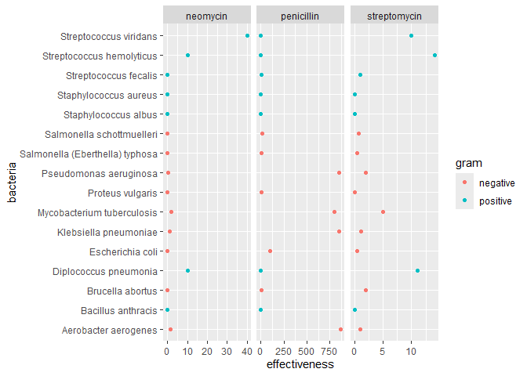
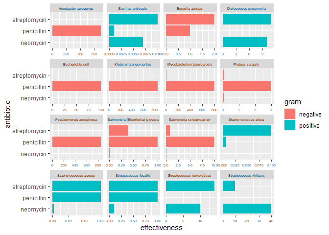
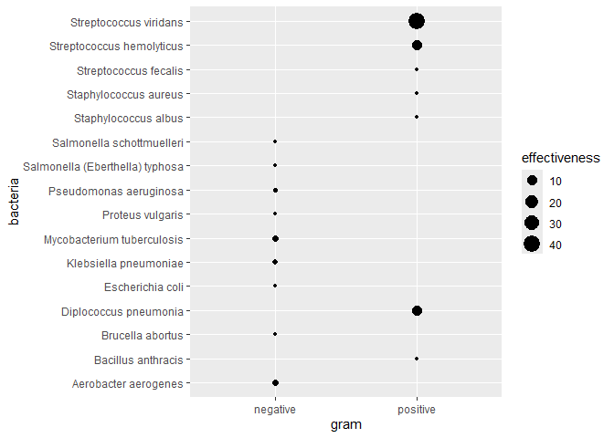
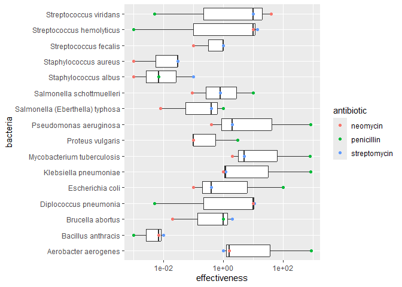
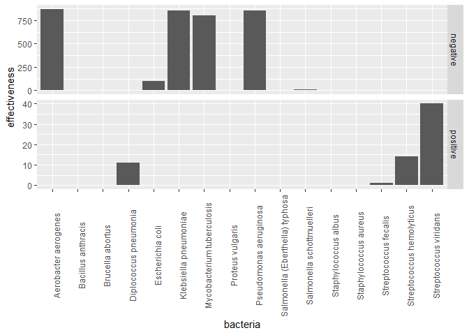

Antibiotics
================
Nerissa Theisen
2026-10-05

*Purpose*: Creating effective data visualizations is an *iterative*
process; very rarely will the first graph you make be the most
effective. The most effective thing you can do to be successful in this
iterative process is to *try multiple graphs* of the same data.

Furthermore, judging the effectiveness of a visual is completely
dependent on *the question you are trying to answer*. A visual that is
totally ineffective for one question may be perfect for answering a
different question.

In this challenge, you will practice *iterating* on data visualization,
and will anchor the *assessment* of your visuals using two different
questions.

*Note*: Please complete your initial visual design **alone**. Work on
both of your graphs alone, and save a version to your repo *before*
coming together with your team. This way you can all bring a diversity
of ideas to the table!

<!-- include-rubric -->

# Grading Rubric

<!-- -------------------------------------------------- -->

Unlike exercises, **challenges will be graded**. The following rubrics
define how you will be graded, both on an individual and team basis.

## Individual

<!-- ------------------------- -->

| Category | Needs Improvement | Satisfactory |
|----|----|----|
| Effort | Some task **q**’s left unattempted | All task **q**’s attempted |
| Observed | Did not document observations, or observations incorrect | Documented correct observations based on analysis |
| Supported | Some observations not clearly supported by analysis | All observations clearly supported by analysis (table, graph, etc.) |
| Assessed | Observations include claims not supported by the data, or reflect a level of certainty not warranted by the data | Observations are appropriately qualified by the quality & relevance of the data and (in)conclusiveness of the support |
| Specified | Uses the phrase “more data are necessary” without clarification | Any statement that “more data are necessary” specifies which *specific* data are needed to answer what *specific* question |
| Code Styled | Violations of the [style guide](https://style.tidyverse.org/) hinder readability | Code sufficiently close to the [style guide](https://style.tidyverse.org/) |

## Submission

<!-- ------------------------- -->

Make sure to commit both the challenge report (`report.md` file) and
supporting files (`report_files/` folder) when you are done! Then submit
a link to Canvas. **Your Challenge submission is not complete without
all files uploaded to GitHub.**

``` r
library(tidyverse)
```

    ## ── Attaching core tidyverse packages ──────────────────────── tidyverse 2.0.0 ──
    ## ✔ dplyr     1.2.1     ✔ readr     2.2.0
    ## ✔ forcats   1.0.1     ✔ stringr   1.6.0
    ## ✔ ggplot2   4.0.3     ✔ tibble    3.3.1
    ## ✔ lubridate 1.9.5     ✔ tidyr     1.3.2
    ## ✔ purrr     1.2.2     
    ## ── Conflicts ────────────────────────────────────────── tidyverse_conflicts() ──
    ## ✖ dplyr::filter() masks stats::filter()
    ## ✖ dplyr::lag()    masks stats::lag()
    ## ℹ Use the conflicted package (<http://conflicted.r-lib.org/>) to force all conflicts to become errors

``` r
library(ggrepel)
library(patchwork)
```

*Background*: The data\[1\] we study in this challenge report the
[*minimum inhibitory
concentration*](https://en.wikipedia.org/wiki/Minimum_inhibitory_concentration)
(MIC) of three drugs for different bacteria. The smaller the MIC for a
given drug and bacteria pair, the more practical the drug is for
treating that particular bacteria. An MIC value of *at most* 0.1 is
considered necessary for treating human patients.

These data report MIC values for three antibiotics—penicillin,
streptomycin, and neomycin—on 16 bacteria. Bacteria are categorized into
a genus based on a number of features, including their resistance to
antibiotics.

``` r
## NOTE: If you extracted all challenges to the same location,
## you shouldn't have to change this filename
filename <- "./data/antibiotics.csv"

## Load the data
df_antibiotics <- read_csv(filename)
```

    ## Rows: 16 Columns: 5
    ## ── Column specification ────────────────────────────────────────────────────────
    ## Delimiter: ","
    ## chr (2): bacteria, gram
    ## dbl (3): penicillin, streptomycin, neomycin
    ## 
    ## ℹ Use `spec()` to retrieve the full column specification for this data.
    ## ℹ Specify the column types or set `show_col_types = FALSE` to quiet this message.

``` r
df_antibiotics %>% knitr::kable()
```

| bacteria                        | penicillin | streptomycin | neomycin | gram     |
|:--------------------------------|-----------:|-------------:|---------:|:---------|
| Aerobacter aerogenes            |    870.000 |         1.00 |    1.600 | negative |
| Brucella abortus                |      1.000 |         2.00 |    0.020 | negative |
| Bacillus anthracis              |      0.001 |         0.01 |    0.007 | positive |
| Diplococcus pneumonia           |      0.005 |        11.00 |   10.000 | positive |
| Escherichia coli                |    100.000 |         0.40 |    0.100 | negative |
| Klebsiella pneumoniae           |    850.000 |         1.20 |    1.000 | negative |
| Mycobacterium tuberculosis      |    800.000 |         5.00 |    2.000 | negative |
| Proteus vulgaris                |      3.000 |         0.10 |    0.100 | negative |
| Pseudomonas aeruginosa          |    850.000 |         2.00 |    0.400 | negative |
| Salmonella (Eberthella) typhosa |      1.000 |         0.40 |    0.008 | negative |
| Salmonella schottmuelleri       |     10.000 |         0.80 |    0.090 | negative |
| Staphylococcus albus            |      0.007 |         0.10 |    0.001 | positive |
| Staphylococcus aureus           |      0.030 |         0.03 |    0.001 | positive |
| Streptococcus fecalis           |      1.000 |         1.00 |    0.100 | positive |
| Streptococcus hemolyticus       |      0.001 |        14.00 |   10.000 | positive |
| Streptococcus viridans          |      0.005 |        10.00 |   40.000 | positive |

# Visualization

<!-- -------------------------------------------------- -->

### **q1** Prototype 5 visuals

To start, construct **5 qualitatively different visualizations of the
data** `df_antibiotics`. These **cannot** be simple variations on the
same graph; for instance, if two of your visuals could be made identical
by calling `coord_flip()`, then these are *not* qualitatively different.

For all five of the visuals, you must show information on *all 16
bacteria*. For the first two visuals, you must *show all variables*.

*Hint 1*: Try working quickly on this part; come up with a bunch of
ideas, and don’t fixate on any one idea for too long. You will have a
chance to refine later in this challenge.

*Hint 2*: The data `df_antibiotics` are in a *wide* format; it may be
helpful to `pivot_longer()` the data to make certain visuals easier to
construct.

#### Visual 1 (All variables)

In this visual you must show *all three* effectiveness values for *all
16 bacteria*. This means **it must be possible to identify each of the
16 bacteria by name.** You must also show whether or not each bacterium
is Gram positive or negative.

``` r
## Uses pivot_longer() on the data to make visuals easier to construct
df_antibiotics <- df_antibiotics %>%
  pivot_longer(
    cols = c("penicillin", "streptomycin", "neomycin"),
    names_to = "antibiotic",
    values_to = "effectiveness"
  )

df_antibiotics
```

    ## # A tibble: 48 × 4
    ##    bacteria              gram     antibiotic   effectiveness
    ##    <chr>                 <chr>    <chr>                <dbl>
    ##  1 Aerobacter aerogenes  negative penicillin         870    
    ##  2 Aerobacter aerogenes  negative streptomycin         1    
    ##  3 Aerobacter aerogenes  negative neomycin             1.6  
    ##  4 Brucella abortus      negative penicillin           1    
    ##  5 Brucella abortus      negative streptomycin         2    
    ##  6 Brucella abortus      negative neomycin             0.02 
    ##  7 Bacillus anthracis    positive penicillin           0.001
    ##  8 Bacillus anthracis    positive streptomycin         0.01 
    ##  9 Bacillus anthracis    positive neomycin             0.007
    ## 10 Diplococcus pneumonia positive penicillin           0.005
    ## # ℹ 38 more rows

``` r
# WRITE YOUR CODE HERE
df_antibiotics %>%
  ggplot(aes(x = effectiveness, y = bacteria, color = gram)) +
  geom_point() + 
  facet_grid(.~ antibiotic, scales = "free_x")
```

<!-- -->

#### Visual 2 (All variables)

In this visual you must show *all three* effectiveness values for *all
16 bacteria*. This means **it must be possible to identify each of the
16 bacteria by name.** You must also show whether or not each bacterium
is Gram positive or negative.

Note that your visual must be *qualitatively different* from *all* of
your other visuals.

``` r
# WRITE YOUR CODE HERE
df_antibiotics %>%
  ggplot(aes(x = effectiveness, y = antibiotic, fill = gram)) +
  geom_col() +
  facet_wrap(vars(bacteria), scales = "free_x") +
  theme(
    strip.text = element_text(size = 5.5),
    axis.text.x = element_text(size = 5.5)
  )
```

<!-- -->

#### Visual 3 (Some variables)

In this visual you may show a *subset* of the variables (`penicillin`,
`streptomycin`, `neomycin`, `gram`), but you must still show *all 16
bacteria*.

Note that your visual must be *qualitatively different* from *all* of
your other visuals.

``` r
# WRITE YOUR CODE HERE
df_antibiotics %>%
  filter(antibiotic == "neomycin") %>%
  ggplot(aes(x = gram, y = bacteria, size = effectiveness)) +
  geom_count()
```

<!-- -->

#### Visual 4 (Some variables)

In this visual you may show a *subset* of the variables (`penicillin`,
`streptomycin`, `neomycin`, `gram`), but you must still show *all 16
bacteria*.

Note that your visual must be *qualitatively different* from *all* of
your other visuals.

``` r
# WRITE YOUR CODE HERE
df_antibiotics %>%
  ggplot(aes(x = effectiveness, y = bacteria)) +
  geom_boxplot() + 
  geom_point(aes(color = antibiotic)) +
  scale_x_log10() 
```

<!-- -->

#### Visual 5 (Some variables)

In this visual you may show a *subset* of the variables (`penicillin`,
`streptomycin`, `neomycin`, `gram`), but you must still show *all 16
bacteria*.

Note that your visual must be *qualitatively different* from *all* of
your other visuals.

``` r
# WRITE YOUR CODE HERE
df_antibiotics %>%
  ggplot(aes(x = bacteria, y = effectiveness)) +
  geom_col(position = "dodge") +
  facet_grid(gram ~., scales = "free_y") +
  theme(
    axis.text.x = element_text(angle = 90)
  )
```

<!-- -->

### **q2** Assess your visuals

There are **two questions** below; use your five visuals to help answer
both Guiding Questions. Note that you must also identify which of your
five visuals were most helpful in answering the questions.

*Hint 1*: It’s possible that *none* of your visuals is effective in
answering the questions below. You may need to revise one or more of
your visuals to answer the questions below!

*Hint 2*: It’s **highly unlikely** that the same visual is the most
effective at helping answer both guiding questions. **Use this as an
opportunity to think about why this is.**

#### Guiding Question 1

> How do the three antibiotics vary in their effectiveness against
> bacteria of different genera and Gram stain?

*Observations* 
- What is your response to the question above? 
  - The three antibiotics vary widely in their effectiveness against bacteria of
    different genera and Gram strain. Penicillin is the most effective
    against bacteria of a positive Gram strain. Its MIC was 1 or over for
    every bacteria with a negative Gram strain, while its MIC was 1 or under
    for every bacteria with a positive Gram strain. Meanwhile, neomycin and
    streptomycin had a less concrete divide between strains, although the
    lowest effectiveness occurrences were for bacteria with a positive Gram
    strain. For neomycin, the MIC values were close together whether the
    strain was negative or positive, except for three large outliers for
    bacteria with positive Gram strain. For streptomycin, most of the MIC
    values were under 2.5 whether the strain was negative or positive. There
    was one outlier for bacteria with a negative strain and three outliers
    for bacteria with a positive strain. Penicillin was significantly less
    effective against aerobacter aerogenes, escherichia coli, klebsiella
    pneumoniae, mycobacterium tubercolosis, proteus vulgaris, pseudomonas
    aeroguinosa, salmonella typhosa, and salmonella schottmuelleri than
    streptomycin and neomycin. Penicillin also had the highest MIC values,
    with it being the only antibiotic to have values over 50. However,
    penicillin was the most effective antibiotic against bacillus anthracis,
    diplococcus pneumonia, streptococcus hemolyticus, and streptococcus
    viridans. Streptomycin had the lowest MIC values, with all of the values
    being under 20. Streptomycin and penicillin had close effectiveness
    values in a couple of instances, and there were a few times where
    streptomycin and neomycin had close values, but neomycin always had a
    significant difference in effectiveness from penicillin.

- Which of your visuals above (1 through 5) is **most effective** at
  helping to answer this question?
  - Visuals 1 and 2 were the most effective in helping to answer this
    question.
- Why?
  - Visual 1 was helpful for comparing effectiveness values for each
    antibiotic on the same scale, while Visual 2 was helpful for looking
    more closely at the actual effectiveness values, since it had a
    different scale for each bacteria. When one plot had an unclear
    comparison, the other was usually able to make it up for it. They
    were also useful because they considered both gram and all of the
    antibiotics, unlike the rest of the visuals.

#### Guiding Question 2

In 1974 *Diplococcus pneumoniae* was renamed *Streptococcus pneumoniae*,
and in 1984 *Streptococcus fecalis* was renamed *Enterococcus fecalis*
\[2\].

> Why was *Diplococcus pneumoniae* was renamed *Streptococcus
> pneumoniae*?

*Observations* 
- What is your response to the question above? 
  - Diplococcus pnuemoniae was likely renamed to Streptococcus pnuemoniae
    because of its similarities in properties to the other Streptococcus
    bacteria (disregarding the later renamed Streptococcus fecalis). For
    both streptomycin and neomycin, Diplococcus pnuemoniae, Streptococcus
    viridans, and Streptococcus hemolyticus had the three highest MIC
    values. They also had similar values for penicillin. When taking every
    antibiotic into account, the three bacteria have very close median
    effectiveness.

- Which of your visuals above (1 through 5) is **most effective** at
  helping to answer this question?
  - Visuals 1 and 4 were the most effective at helping to answer this
    question.
- Why?
  - Visual 4 was useful for looking at effectiveness as a whole for each
    bacteria across the dataset, while Visual 1 was helpful for
    comparing effectiveness values based on antibiotic. Having both the
    general overview and the more specific plot ensured that
    similarities or differences were there across the board. The other
    plots are harder to use when comparing specific bacteria because
    certain values are not visible or the variables are grouped together
    in unhelpful ways. For example, Visuals 3 and 5 aren’t well tailored
    this question because they split up Gram strain, and the bacteria we
    are inspecting all have the same strain.

# References

<!-- -------------------------------------------------- -->

\[1\] Neomycin in skin infections: A new topical antibiotic with wide
antibacterial range and rarely sensitizing. Scope. 1951;3(5):4-7.

\[2\] Wainer and Lysen, “That’s Funny…” *American Scientist* (2009)
[link](https://www.americanscientist.org/article/thats-funny)
